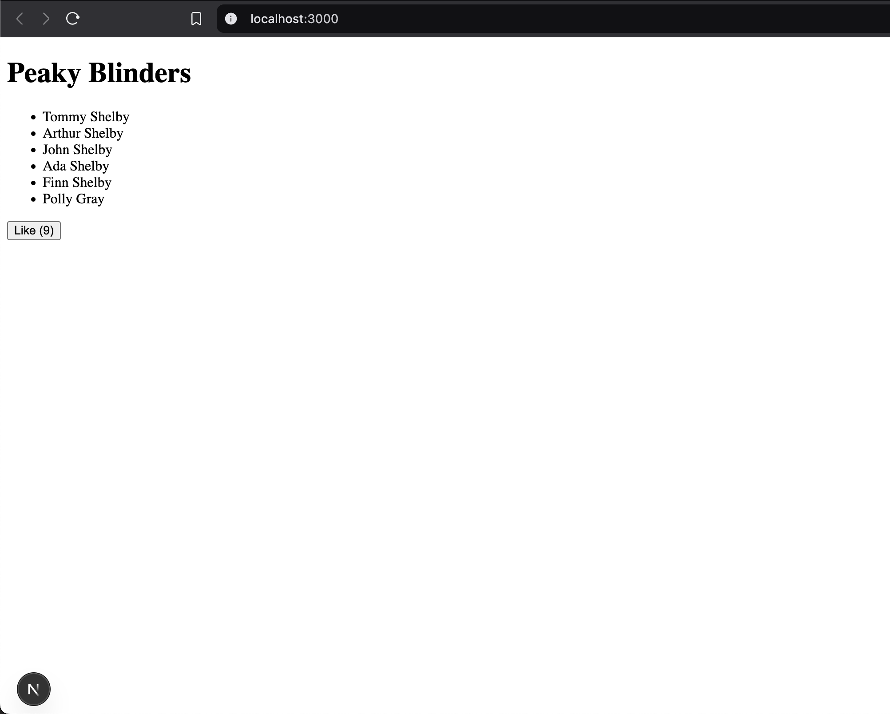

# react_next_tutorial

This is me revising some basic fundamentals of ReactJS and start to learning NextJs.

The app started as a simple index.html file with react loaded as a script there,
then started making a very basic and very simple React app by creating the ReactDOM root node, which basically points to the `div` element with the `id="app"` as the root element to hold React components later on. After that a simple Header component which contains of an `h1` element with some text on it, which then is rendered using the React `render` method, which manipulates the DOM to show the changes. 

Then I started to use nested components by adding a HomePage component which wrapped the Header component at first, then multiple elements and then added more elemnts by leaverging the JS in JSX functionality to iterate over a list of names and dynamically add `<li>` elements in an unordered list `<ul>`. Also used React props with the Header component to dynamically reuse the component with different titles and also set a default title in place in case none is provided.

Later on I added a likes button that increments and shows the number of current likes through using React hooks and component state through the `useState` function with a default number of likes, 0. So when the button is clicked, the `onClick` event listner on the button is hooked with a function I defined called `handleClick` which inside uses the `useState` provided function to set the number of like and return the value which is captured through deconstruction of the returnded value of the `useState` function and set in a var named `likesCount`. 

### Rearranging the app and use Next.js

Using Next.js is pretty simple and straight forward through installing everything with `npm` including `react` and `react-dom` packages. Next.js app routing depends on folder naming, so I rearranged the files and created the root folder that Next looks for called `app` and then renamed the main file to `page.js` and this is the main page Next is gonna show.

After adding a `script` key to the `package.json` file to use `npm run dev` on my app and start the server, I got an error with the main arrangement of the `page.js` file, because at that point everything was in that file, and Next.js uses React Server Components by default, while we are using a `useState` inside that file, which is by default a React Server Component. So I had to move the LikesButton in its own component file along with all it's related code and of course tell Next.js that this is a React Client Component by declaring that at the top level of the file with a simple `'use client';` line.

After that the app reloaded with the Fresh Reload functionality provided in Next.js local server, and it worked.

Here is a screenshot of the simple app:

